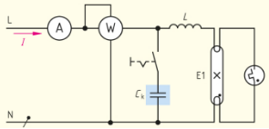

<!--

language: de

-->

# Kompensation

Zum Einstieg gemeinsam an Tafel zusammentragen:

> __Leistungen im $ \approx $:__
>
> $ S = \sqrt{ P^2 + Q^2} $ und $ S = U \cdot I $
>
> $ \cos \phi = \frac{P}{S} $ bzw. $ \sin \phi = \frac{Q}{S} $
>
> __Widerstände im $ \approx $:__
>
> $ Z = \sqrt{ R^2 + X^2} $ und $ \cos \phi = \frac{R}{Z} $, $ X_L = \omega \cdot L $ und $ X_C = \frac{1}{\omega \cdot C} $
>
> __Spannung/Strom im $ \approx $:__
>
> $ U = \sqrt{ U_R^2 + U_{LC}^2} $ à Reihenschaltung $( \text{I} = \text{konst.} )$
>
> $ I = \sqrt{ I_R^2 + I_{LC}^2} $ à Parallelschaltung $( \text{U} = \text{konst.} )$

---

> S ... Scheinleistung [VA] \
> P ... Wirkleistung [W] \
> Q ... Blindleistung [var]
>
> Z ... Scheinwiderstand [Ω] \
> R ... Wirkwiderstand [Ω] \
> X ... Blindwiderstand [Ω]

## 1. Arbeitsauftrag Leuchtstofflampe

Wiederholung mittels S16-17_Arbeitsheft_europa [EA, 25 min] oder

## 2. Einführung und Definition

Bei den häufig auftretenden induktiven Belastungen im Netz, z.B. an Drosselspulen, kommt es zu einer Phasenverschiebung $\phi$ zwischen der anliegenden Spannung $\text{U}$ und der Stromstärke $\text{I}$.

__Darstellung von Spannung und Strom bei einer Phasenverschiebung $ \phi = $ °__

Als Folge entsteht im Stromkreis neben der Wirk- auch Blindleistung.
Die vom Energieversorger gelieferte (und vom Kunden bezahlte) Scheinleistung ist somit größer als die tatsächlich benötigte Wirkleistung.
Mit einem Kondensator kann die Phasenverschiebung verringert bzw. ganz aufgehoben werden, so dass die vom Energieversorger bereitgestellte Leistung der tatsächlich benötigten Wirkleistung entspricht.

__Praxis-Versuch:__
Die abgebildete Leuchtstofflampe wird über die zugehörige Drossel ohne Kompensationskondensator an die Netzspannung angeschlossen.
Leistung und Stromstärke werden gemessen. Danach wird der Kompensationskondensator parallel zur Reihenschaltung aus Lampe und Drossel geschaltet.

Aufgabe: [EA, 3 min]
Lösen Sie S.16 -17 des Lernauftrags "18W-Leuchtstofflampe".  zu S.17 5.):

mit $ C_K $

- [( )] bleibt gleich
- [(X)] verringert sich
- [( )] erhöht sich
- [( )] kann nicht beurteilt werden

Mit dem Zuschalten des Kondensators nimmt die Stromaufnahme der Schaltung ab, der Leistungsmesser zeigt dagegen dieselbe Wirkleistung an.

---

danach Experiment in falstad umsetzen
AB_Kompensation

<iframe src="https://www.falstad.com/circuit/circuitjs.html" width="100%" height="500" allowfullscreen="allowfullscreen"></iframe>

